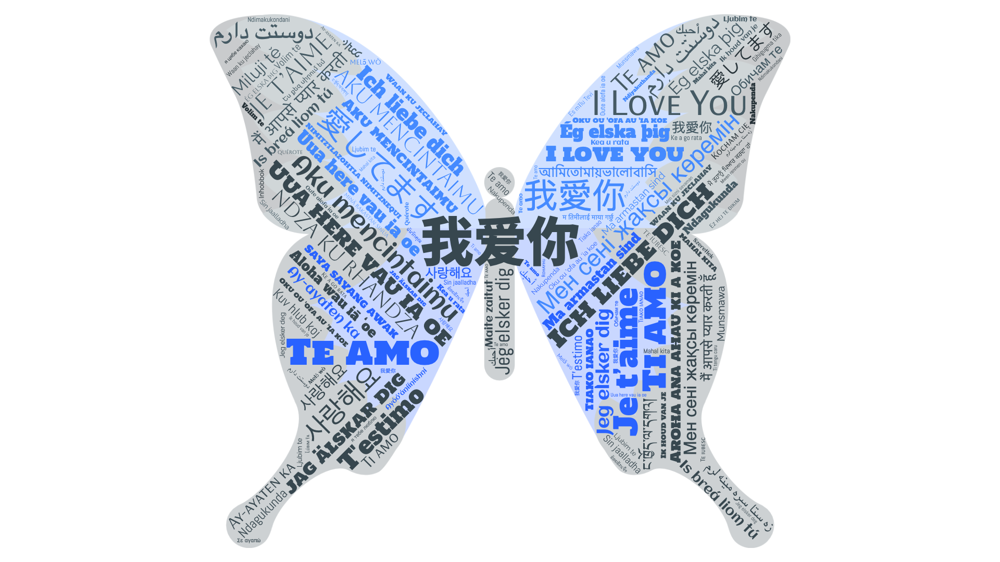

## 项目简介 Project Overview

专门为女朋友制作的网站，结合HTML、CSS和JavaScript，为她提供一个温馨且有趣的生日体验。项目基于原作者 [faahim](https://github.com/faahim) 的作品进行了一些定制化修改。

This website is a special birthday gift I created for my girlfriend using HTML, CSS, and JavaScript. The project is based on the original work by [faahim](https://github.com/faahim), with custom modifications to personalize it for her.

## 致谢

感谢[faahim](https://github.com/faahim)的原始作品，为我的项目提供了很好的基础。

感谢我的女朋友xjy，让我从零学习html+css+js并掌握了一些写网站的能力，希望这个小礼物能给她带来惊喜。

Thank you to [faahim](https://github.com/faahim) for the original work, which provided a great foundation for my project.

Thanks to my girlfriend xjy for giving me the chance of learning HTML, CSS, and JavaScript from scratch, allowing me to gain some skills in building websites. I hope this small gift brings her joy.

## 联系方式

如有任何问题或建议，请随时联系：

If you have any questions or suggestions, please feel free to contact me:

- GitHub: [yyyypong](https://github.com/yyyypong)
- Email: yympong@connect.ust.hk
- notion: [glorypyy](https://glorypyy.notion.site/)
